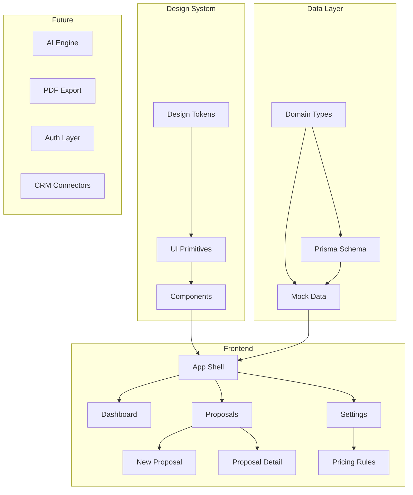
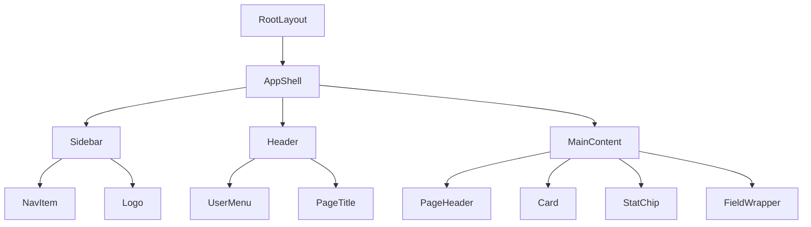

# Ordinexa Implementation Plan

## Overview

This document outlines the implementation plan for Ordinexa, a B2B AI proposal workspace. The MVP is broken into incremental steps, with Step 1 focusing on foundation and baseline setup.

## Step Breakdown

### Step 1: Foundation & Baseline (Current)

**Goal**: Establish project foundation, app shell, design system, and core routes with mock data.

**Work Items**:
- ORDX-001: Project foundation and baseline setup
- ORDX-002: App shell and primary routes
- ORDX-003: Design tokens and light-first visual foundation
- ORDX-004: Domain types and mock seed data
- ORDX-005: Local planning docs under /plans
- ORDX-006: Playwright smoke tests
- ORDX-007: Commit and push to main

**Deliverables**:
- Next.js 16.2 project with TypeScript
- Tailwind CSS v4 with design tokens
- App shell with sidebar navigation
- Routes: /dashboard, /proposals/new, /proposals/[id], /settings/pricing
- Domain types and mock data
- Prisma schema (foundation only)
- Playwright smoke tests

---

### Step 2: Estimation Engine

**Goal**: Implement pricing calculation logic and real-time estimates.

**Planned Features**:
- Pricing formula engine
- Real-time estimate calculations
- Line item management
- Subtotal/tax/total logic
- Estimate validation

**Dependencies**: Step 1 complete

---

### Step 3: AI Integration

**Goal**: Integrate OpenAI for proposal content generation.

**Planned Features**:
- OpenAI API integration
- Section content generation
- Smart suggestions
- Template-based generation
- Content refinement

**Dependencies**: Step 2 complete

---

### Step 4: Export & Sharing

**Goal**: Enable PDF export and proposal sharing.

**Planned Features**:
- PDF generation (React PDF or similar)
- Email integration
- Public proposal links
- Brand customization
- Export templates

**Dependencies**: Step 3 complete

---

### Step 5: Authentication & Multi-tenancy

**Goal**: Add user authentication and organization management.

**Planned Features**:
- Authentication (NextAuth.js or Clerk)
- Organization management
- Team invites
- Role-based access control
- User settings

**Dependencies**: Step 4 complete

---

### Step 6: CRM Integration

**Goal**: Connect with external CRM systems.

**Planned Features**:
- Salesforce integration
- HubSpot integration
- Contact synchronization
- Deal pipeline sync
- Activity logging

**Dependencies**: Step 5 complete

---

## Technical Decisions

### Framework & Tooling

| Decision | Choice | Rationale |
|----------|--------|-----------|
| Framework | Next.js 16.2 | Latest stable, App Router, Turbopack |
| Styling | Tailwind CSS v4 | Latest, CSS-first configuration |
| ORM | Prisma 7.x | Type-safe, PostgreSQL support |
| Testing | Playwright | E2E testing, multi-browser |
| Language | TypeScript | Type safety, better DX |

### Project Structure

- **Flat structure**: No /src directory (per project constraints)
- **App Router**: Using Next.js App Router for routing
- **Component organization**: /components with ui/, layout/, domain/ subdirectories
- **Planning docs**: All under /plans directory

### Design System

- **Semantic tokens**: Colors, spacing, etc. defined as CSS custom properties
- **Light-first**: Optimized for light mode, dark mode prepared but not implemented
- **Component primitives**: Reusable UI components for consistency

### Data Strategy

- **Step 1**: Mock data only, no database connection required
- **Future**: PostgreSQL with Prisma ORM
- **Seed data**: Realistic sample data for development

## Architecture Diagram



## Route Structure

```mermaid
graph LR
    A[/] -->|redirect| B[/dashboard]
    B --> C[/proposals]
    C --> D[/proposals/new]
    C --> E[/proposals/id]
    A --> F[/settings]
    F --> G[/settings/pricing]
```

## Component Hierarchy



## File Structure (Step 1)

```
ordinexa-proposals/
├── app/
│   ├── globals.css              # Global styles + Tailwind
│   ├── layout.tsx               # Root layout
│   ├── page.tsx                 # Redirect to dashboard
│   ├── dashboard/
│   │   └── page.tsx             # Dashboard view
│   ├── proposals/
│   │   ├── new/
│   │   │   └── page.tsx         # New proposal form
│   │   └── [id]/
│   │       └── page.tsx         # Proposal detail
│   └── settings/
│       └── pricing/
│           └── page.tsx         # Pricing rules
├── components/
│   ├── ui/
│   │   ├── button.tsx
│   │   ├── card.tsx
│   │   ├── input.tsx
│   │   ├── select.tsx
│   │   ├── badge.tsx
│   │   └── index.ts
│   ├── layout/
│   │   ├── app-shell.tsx
│   │   ├── sidebar.tsx
│   │   ├── header.tsx
│   │   └── page-header.tsx
│   └── domain/
│       ├── proposal-card.tsx
│       ├── proposal-form.tsx
│       ├── pricing-rule-card.tsx
│       └── stat-chip.tsx
├── lib/
│   ├── utils.ts                 # Utility functions
│   └── cn.ts                    # Class name helper
├── types/
│   ├── proposal.ts
│   ├── pricing.ts
│   └── index.ts
├── data/
│   ├── mock-proposals.ts
│   ├── mock-pricing.ts
│   └── index.ts
├── prisma/
│   └── schema.prisma            # Prisma schema
├── tests/
│   └── e2e/
│       ├── dashboard.spec.ts
│       ├── proposals.spec.ts
│       └── settings.spec.ts
├── plans/
│   ├── product-spec.md
│   └── implementation-plan.md
├── .env.example
├── package.json
├── tsconfig.json
├── tailwind.config.ts
├── postcss.config.mjs
├── playwright.config.ts
└── README.md
```

## Testing Strategy

### E2E Tests (Playwright)

| Test | Route | Description |
|------|-------|-------------|
| Dashboard loads | /dashboard | Verify dashboard renders with proposals |
| Create proposal form | /proposals/new | Verify form fields and submission |
| Proposal detail | /proposals/[id] | Verify proposal detail view |
| Pricing settings | /settings/pricing | Verify pricing rule sections |
| Navigation | All | Verify sidebar navigation works |

### Type Safety

- TypeScript strict mode
- Domain types for all entities
- Prisma-generated types (when DB connected)

## Quality Gates

Before each commit:
1. `npm install` - Dependencies install cleanly
2. `npm run typecheck` - No TypeScript errors
3. `npm run lint` - No ESLint errors
4. `npm run test` - All Playwright tests pass
5. `npm run build` - Production build succeeds

## Git Workflow

- **No PR/MR workflow**: Direct commits to main after tests pass
- **Commit messages**: Clear, descriptive messages referencing work items
- **Example**: `feat(ORDX-002): implement app shell with sidebar navigation`

## Risk Mitigation

| Risk | Mitigation |
|------|------------|
| Tailwind v4 breaking changes | Follow official Next.js integration guide |
| Prisma setup complexity | Keep schema simple, use mock data initially |
| Design system inconsistency | Use semantic tokens, build primitives first |
| Test flakiness | Use Playwright best practices, proper waits |

## Next Actions

After Step 1 is complete:
1. Review and validate the foundation
2. Plan Step 2 estimation engine in detail
3. Gather feedback on UI/UX
4. Refine design tokens based on actual usage
